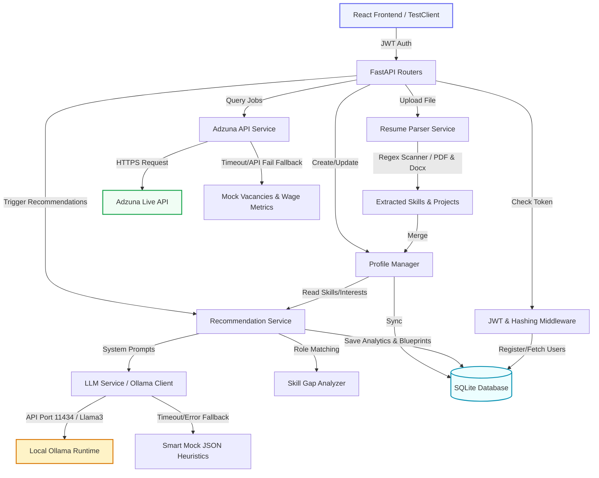

# 🚀 AI-Powered Career Recommendation System

[](https://www.python.org/)
[](https://fastapi.tiangolo.com/)
[](https://www.sqlite.org/)
[-orange.svg)](https://ollama.com/)
[](https://www.docker.com/)
[](https://github.com/AARAV-git/Job-Search/actions)

An ultra-modern, end-to-end FastAPI backend coupled with local Large Language Models (LLM) and live market index endpoints to deliver hyper-personalized career roadmaps, automated resume scans, skill gap matrices, and salary analytics.

---

## 🗺️ System Data Flow & Architecture



---

## 📂 Project Directory Structure

```text
career_recommendation_system/
│
├── .github/
│   └── workflows/
│       └── backend-ci-cd.yml     # GitHub Actions CI/CD Pipeline
│
├── backend/
│   ├── app/
│   │   ├── main.py               # FastAPI application bootstrapper & routing imports
│   │   ├── config.py             # Settings configurations (BaseSettings reading from .env)
│   │   ├── database.py           # SQLAlchemy SQLite engine & session generators
│   │   ├── dependencies.py       # Dependency injector (JWT session validation & active user guards)
│   │   │
│   │   ├── models/               # SQLAlchemy Database Schemas (Physical Tables)
│   │   │   ├── user.py           # Users model (authentication data, relations)
│   │   │   ├── profile.py        # User profiles (skills, experience, interest strings)
│   │   │   ├── resume.py         # Ingested resume structures & text extracts
│   │   │   ├── recommendation.py # Stored AI career recommendations, roadmaps, and gap JSONs
│   │   │   ├── jobs.py           # Job cache listings schema
│   │   │   └── analytics.py      # Aggregated metrics database schema
│   │   │
│   │   ├── schemas/              # Pydantic Request/Response validation layers
│   │   │   ├── auth_schema.py    # Login, registration, token payload parameters
│   │   │   ├── profile_schema.py # User profile setup structures
│   │   │   ├── resume_schema.py  # Binary parsing feedback models
│   │   │   ├── recommendation_schema.py # AI roadmap & career projection structures
│   │   │   └── jobs_schema.py    # Adzuna job entries and salary statistics
│   │   │
│   │   ├── routes/               # API Controllers (Endpoint Handlers)
│   │   │   ├── auth.py           # User access: /auth/register, /auth/login, /auth/me
│   │   │   ├── profile.py        # Portfolio setup: /profile/create, /profile/update, /profile/{id}
│   │   │   ├── resume.py         # File inputs: /resume/upload, /resume/{id}
│   │   │   ├── recommendation.py # Core engine: /recommend-career, /recommendations/{id}
│   │   │   ├── jobs.py           # External vacancies: /jobs/search, /jobs/trending
│   │   │   └── analytics.py      # Insights: /analytics/top-skills, /analytics/salary-trends
│   │   │
│   │   ├── services/             # Core Core Logic (Third-Party APIs & File Parsers)
│   │   │   ├── llm_service.py    # Local Ollama client with fallback mock JSON heuristics
│   │   │   ├── resume_parser.py  # Binary PDF / DOCX scanner and parser
│   │   │   ├── adzuna_service.py # Live job listing aggregator and salary stats crawler
│   │   │   ├── recommendation_service.py # Career intelligence workflow manager
│   │   │   ├── skill_gap_service.py # Core logic mapping missing skills and importance
│   │   │   └── analytics_service.py # Platform aggregation stats computer
│   │   │
│   │   ├── prompts/              # LLM System Prompts
│   │   │   ├── career_prompt.txt     # Main career prompt using profile inputs
│   │   │   ├── roadmap_prompt.txt    # Step-by-step roadmap template
│   │   │   └── skill_gap_prompt.txt  # Profile comparative gap prompt
│   │   │
│   │   └── utils/                # General Helpers
│   │       ├── hashing.py            # Password hashing functions using raw bcrypt
│   │       ├── jwt_handler.py        # Signed JWT encoders and token decoders
│   │       ├── validators.py         # Input parsing constraints (email/password format)
│   │       └── helpers.py            # String parsers and JSON conversions
│   │
│   ├── database/
│   │   └── career_system.db      # Automatically initialized SQLite database
│   │
│   ├── tests/
│   │   └── test_backend.py       # Complete integration testing suite (All 5 suites)
│   │
│   ├── .env                      # Application secret configurations & API Keys
│   ├── requirements.txt          # Third-party Python dependencies
│   ├── vercel.json               # Serverless host configurations (FastAPI + Vercel)
│   ├── Dockerfile                # Production container specifications
│   └── run.py                    # Dev server launcher
│
└── README.md                     # Single Source of Truth setup and API Guide
```

---

## 🗃️ Database Schemas & Entity Relationships

The system utilizes an SQL database with the following table mappings and foreign key relationships:

```text
 ┌───────────────┐          ┌────────────────────┐          ┌────────────────────┐
 │     users     │ 1 ──── 1 │   user_profiles    │ 1 ──── 1 │      resumes       │
 ├───────────────┤          ├────────────────────┤          ├────────────────────┤
 │ id (PK)       │          │ id (PK)            │          │ id (PK)            │
 │ name          │          │ user_id (FK)       │          │ user_id (FK)       │
 │ email (Unique)│          │ skills (TEXT/JSON) │          │ resume_path        │
 │ password_hash │          │ interests (TEXT)   │          │ extracted_skills   │
 └───────┬───────┘          │ certifications     │          └────────────────────┘
         │                  │ projects (JSON)    │
         │ 1                │ experience (JSON)  │
         │                  └────────────────────┘
         ▼ N
 ┌──────────────────────┐
 │   recommendations    │
 ├──────────────────────┤
 │ id (PK)              │
 │ user_id (FK)         │
 │ recommended_roles    │  <-- JSON Text: Role name, Match Score, Reasoning
 │ skill_gaps           │  <-- JSON Text: Gaps by role, Importance priority
 │ roadmap              │  <-- JSON Text: Chronological learning steps, resources
 │ explanation          │  <-- Global system summary
 └──────────────────────┘
```

---

## 🔌 API Endpoints & Request/Response Contracts

### Authentication (`/auth`)

#### `POST /auth/register`
Creates a new user. Passwords must be at least 8 characters.
*   **Request Body**:
    ```json
    {
      "name": "Alex Mercer",
      "email": "alex.mercer@example.com",
      "password": "securepassword123"
    }
    ```
*   **Response (201 Created)**:
    ```json
    {
      "id": 1,
      "name": "Alex Mercer",
      "email": "alex.mercer@example.com"
    }
    ```

#### `POST /auth/login`
Validates credentials and yields a signed JWT authorization token.
*   **Request Body**:
    ```json
    {
      "email": "alex.mercer@example.com",
      "password": "securepassword123"
    }
    ```
*   **Response (200 OK)**:
    ```json
    {
      "access_token": "eyJhbGciOi...",
      "token_type": "bearer"
    }
    ```

#### `GET /auth/me`
Fetches the active authenticated user profile details.
*   **Headers Required**: `Authorization: Bearer <access_token>`
*   **Response (200 OK)**:
    ```json
    {
      "id": 1,
      "name": "Alex Mercer",
      "email": "alex.mercer@example.com"
    }
    ```

---

### User Portfolios & Resumes (`/profile` & `/resume`)

#### `POST /profile/create` & `PUT /profile/update`
Configures or overrides manual career portfolios.
*   **Headers Required**: `Authorization: Bearer <access_token>`
*   **Request Body**:
    ```json
    {
      "skills": ["Python", "FastAPI", "Docker", "SQL"],
      "interests": ["Backend Development", "AI Engineering"],
      "certifications": ["AWS Practitioner"],
      "projects": [
        {
          "name": "Shopping Portal",
          "description": "E-Commerce microservices API",
          "technologies": ["FastAPI", "PostgreSQL"]
        }
      ],
      "experience": [
        {
          "company": "Tech Labs",
          "role": "Junior Backend Developer",
          "duration": "1 year",
          "description": "Configured database sessions and API routers."
        }
      ]
    }
    ```
*   **Response (201 Created / 200 OK)**: Renders the updated/created profile along with its database ID.

#### `POST /resume/upload`
Uploads a binary resume document and automatically parses it for skills and projects.
*   **Headers Required**: `Authorization: Bearer <access_token>`
*   **Request Body**: `Multipart/Form-Data` containing `"file"` (PDF, DOCX, or TXT).
*   **Response (201 Created)**:
    ```json
    {
      "resume_id": 1,
      "skills": ["Python", "FastAPI", "Docker", "SQL"],
      "experience": "Junior Backend Developer at Tech Labs...",
      "projects": "Shopping Portal: E-Commerce microservices..."
    }
    ```

---

### Recommendations & Job Searching (`/recommend-career` & `/jobs`)

#### `POST /recommend-career`
Orchestrates prompt templates with active user skills to generate 3 careers, roadmap nodes, and skill gap priorities.
*   **Headers Required**: `Authorization: Bearer <access_token>`
*   **Response (200 OK)**:
    ```json
    {
      "id": 1,
      "user_id": 1,
      "recommended_roles": [
        {
          "role": "Data Scientist",
          "match_score": 95,
          "why_recommended": "Based on solid math and Python foundation...",
          "primary_skills_matched": ["Python"]
        }
      ],
      "skill_gaps": [
        {
          "role": "Data Scientist",
          "missing_skills": ["MLOps", "TensorFlow"],
          "importance": {
            "MLOps": "High",
            "TensorFlow": "Medium"
          }
        }
      ],
      "roadmap": [
        {
          "role": "Data Scientist",
          "steps": [
            {
              "step": 1,
              "name": "Master Machine Learning Foundations",
              "description": "Build models using Scikit-Learn...",
              "topics": ["Regression", "Supervised Learning"],
              "resources": ["Coursera DS Spec"]
            }
          ],
          "recommended_certifications": ["AWS Certified Machine Learning Specialty"],
          "suggested_projects": [
            {
              "name": "Predictive Pipeline",
              "description": "Train and containerize a random forest model.",
              "technologies": ["Python", "Docker"]
            }
          ]
        }
      ],
      "explanation": "Narrative explanation detailing recommendations..."
    }
    ```

#### `GET /jobs/search`
Retrieves live postings matching a specific role using the Adzuna API.
*   **Headers Required**: `Authorization: Bearer <access_token>`
*   **Query Parameters**: `role` (e.g., "Data Scientist"), `location` (e.g., "London")
*   **Response (200 OK)**:
    ```json
    [
      {
        "role_name": "Junior Data Scientist",
        "company": "DeepMind",
        "location": "London, UK",
        "salary_min": 65000.0,
        "salary_max": 85000.0,
        "description": "Work on state-of-the-art predictive networks...",
        "redirect_url": "https://api.adzuna.com/..."
      }
    ]
    ```

---

## ⚙️ Setup & Installation Guide

### Prerequisites
*   Python 3.10, 3.11, or 3.12 installed on your machine.
*   [Ollama runtime installed and running](https://ollama.com).

### 1. Initialize Virtual Environment
Navigate to the `backend` folder:
```bash
cd backend
python -m venv venv
```
*   **Windows**:
    ```powershell
    .\venv\Scripts\Activate.ps1
    ```
*   **macOS / Linux**:
    ```bash
    source venv/bin/activate
    ```

### 2. Install Package Dependencies
Install all packages listed in `requirements.txt`:
```bash
pip install -r requirements.txt
```

> [!IMPORTANT]
> **Common Installation Issue**: 
> If you encounter an error stating:
> `ImportError: email-validator is not installed, run pip install 'pydantic[email]'`
> Execute this command in your active virtual environment to install the missing validation library:
> ```bash
> pip install email-validator
> ```

### 3. Setup Local Environment Variables
Create a file named `.env` in the `backend/` root directory:
```ini
SECRET_KEY="your-custom-very-long-signing-key-string"
DATABASE_URL="sqlite:///./database/career_system.db"
OLLAMA_HOST="http://localhost:11434"
OLLAMA_MODEL="llama3"
ADZUNA_APP_ID="5c69a352"
ADZUNA_API_KEY="427131c718ad5f1e7d7586a695febcb9"
```

### 4. Fetch the AI Model
Verify that your local Ollama app is active, then pull the Llama3 model used in the prompt configurations:
```bash
ollama pull llama3
```

---

## 🧪 Running & Verifying the Application

### Run the FastAPI Development Server
Use the launcher script `run.py` to start the application with hot-reloading:
```bash
python run.py
```
*   The server will start at `http://127.0.0.1:8000`
*   Open the interactive API playground at **`http://127.0.0.1:8000/docs`** to test endpoints directly.

### Run the Automated Integration Suite
Run the 5 integration tests which validate authentication, profiles, LLM fallback behaviors, Adzuna job parsing, and resume ingestion:
```powershell
# Set PYTHONPATH environment variable to include the current directory
$env:PYTHONPATH="."
python tests/test_backend.py
```
*Expected Output:*
```text
Ran 5 tests in 72.572s

OK
```

---

## 🔁 CI/CD Pipeline (GitHub Actions)

A fully integrated CI/CD pipeline configuration is located in `.github/workflows/backend-ci-cd.yml`.

### Key Pipeline Stages:
1.  **Code Ingestion & Trigger**: Triggers automatically on any push or pull request to the `main` branch affecting files inside `career_recommendation_system/backend/**`.
2.  **Lint & Syntax Checks**: Validates formatting with `black` and reviews Python code structure with `flake8`.
3.  **Automatic Testing**: Spins up a clean Python environment, installs dependencies, constructs a temporary DB, and runs the `unittest` test suite.
4.  **Docker Containment Verification**: Builds the local Docker image and executes a test startup, querying the health endpoint to guarantee that containerized deployments run cleanly.

---

## 🐳 Deployment & Containerization

### Build & Run locally with Docker
A production Docker container configuration is provided under `backend/Dockerfile`.

1.  **Build the Docker Image**:
    ```bash
    docker build -t career-system-backend .
    ```
2.  **Run the Containerized Service**:
    ```bash
    docker run -p 8000:8000 --env-file .env career-system-backend
    ```
    *   The container will spin up the FastAPI service and bind port `8000` of the container to port `8000` of the host system.

### Vercel Serverless Hosting
The folder includes a preconfigured `vercel.json` for serverless API execution.

*   Ensure your repository's backend is linked to Vercel.
*   The deployment will automatically detect `app/main.py` using `@vercel/python` and configure the routing logic cleanly.
*   **Remember** to configure your `.env` variables under Vercel's **Environment Variables** dashboard settings before building.
