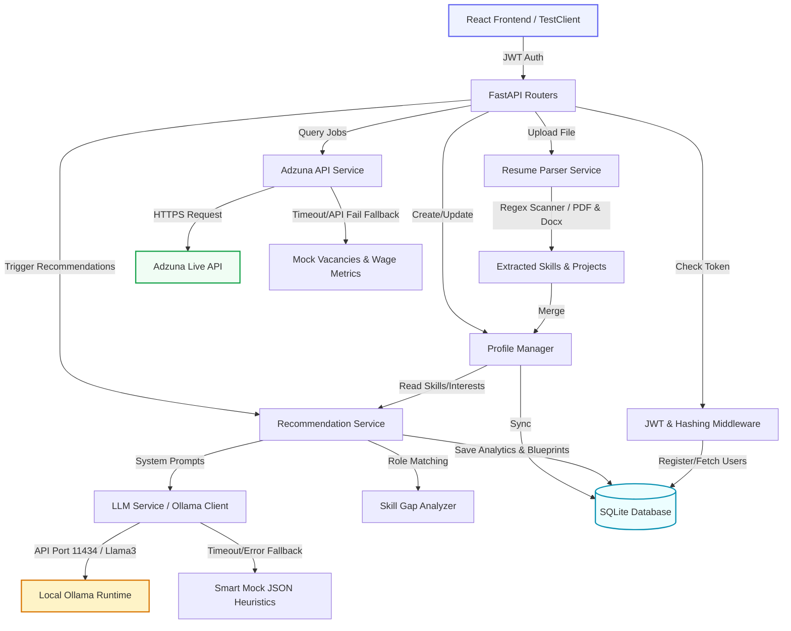

# 🚀 AI-Powered Career Recommendation System

[](https://www.python.org/)
[](https://fastapi.tiangolo.com/)
[](https://www.sqlite.org/)
[-orange.svg)](https://ollama.com/)
[](https://www.docker.com/)

An ultra-modern, end-to-end FastAPI backend coupled with local Large Language Models (LLM) and live market index endpoints to deliver hyper-personalized career roadmaps, automated resume scans, skill gap matrices, and salary analytics.

---

## 🗺️ System Data Flow & Architecture



---

## 📂 Project Directory Structure

```text
career_recommendation_system/
│
├── backend/
│   ├── app/
│   │   ├── main.py               # FastAPI entry point
│   │   ├── config.py             # Settings configurations (.env)
│   │   ├── database.py           # SQLAlchemy SQLite connection
│   │   ├── dependencies.py       # JWT session auth dependency
│   │   │
│   │   ├── models/               # SQLAlchemy Database Schemas (Physical Tables)
│   │   │   ├── user.py           # Users model (authentication data, relations)
│   │   │   ├── profile.py        # User profiles (skills, experience, interest strings)
│   │   │   ├── resume.py         # Ingested resume structures & text extracts
│   │   │   ├── recommendation.py # Stored AI career recommendations, roadmaps, and gap JSONs
│   │   │   ├── jobs.py           # Job cache listings schema
│   │   │   └── analytics.py      # Aggregated metrics database schema
│   │   │
│   │   ├── schemas/              # Pydantic Request/Response validation layers
│   │   │   ├── auth_schema.py    # Login, registration, token payload parameters
│   │   │   ├── profile_schema.py # User profile setup structures
│   │   │   ├── resume_schema.py  # Binary parsing feedback models
│   │   │   ├── recommendation_schema.py # AI roadmap & career projection structures
│   │   │   └── jobs_schema.py    # Adzuna job entries and salary statistics
│   │   │
│   │   ├── routes/               # API Controllers (Endpoint Handlers)
│   │   │   ├── auth.py           # User access: /auth/register, /auth/login, /auth/me
│   │   │   ├── profile.py        # Portfolio setup: /profile/create, /profile/update, /profile/{id}
│   │   │   ├── resume.py         # File inputs: /resume/upload, /resume/{id}
│   │   │   ├── recommendation.py # Core engine: /recommend-career, /recommendations/{id}
│   │   │   ├── jobs.py           # External vacancies: /jobs/search, /jobs/trending
│   │   │   └── analytics.py      # Insights: /analytics/top-skills, /analytics/salary-trends
│   │   │
│   │   ├── services/             # Core Core Logic (Third-Party APIs & File Parsers)
│   │   │   ├── llm_service.py    # Local Ollama client with fallback mock JSON heuristics
│   │   │   ├── resume_parser.py  # Binary PDF / DOCX scanner and parser
│   │   │   ├── adzuna_service.py # Live job listing aggregator and salary stats crawler
│   │   │   ├── recommendation_service.py # Career intelligence workflow manager
│   │   │   ├── skill_gap_service.py # Core logic mapping missing skills and importance
│   │   │   └── analytics_service.py # Platform aggregation stats computer
│   │   │
│   │   ├── prompts/              # LLM System Prompts
│   │   │   ├── career_prompt.txt     # Main career prompt using profile inputs
│   │   │   ├── roadmap_prompt.txt    # Step-by-step roadmap template
│   │   │   └── skill_gap_prompt.txt  # Profile comparative gap prompt
│   │   │
│   │   └── utils/                # General Helpers
│   │       ├── hashing.py            # Password hashing functions using raw bcrypt
│   │       ├── jwt_handler.py        # Signed JWT encoders and token decoders
│   │       ├── validators.py         # Input parsing constraints (email/password format)
│   │       └── helpers.py            # String parsers and JSON conversions
│   │
│   ├── database/
│   │   └── career_system.db      # Automatically initialized SQLite database
│   │
│   ├── tests/
│   │   └── test_backend.py       # Complete integration testing suite (All 5 suites)
│   │
│   ├── .env                      # Application secret configurations & API Keys
│   ├── requirements.txt          # Third-party Python dependencies
│   ├── vercel.json               # Serverless host configurations (FastAPI + Vercel)
│   ├── Dockerfile                # Production container specifications
│   └── run.py                    # Dev server launcher
│
└── README.md                     # Single Source of Truth setup and API Guide
